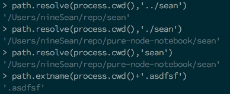

# static server
- HTTP --> 无状态 应用层协议
- `body`（服务端一般通过stream读取） --> 通过stream的方式，一个chunk一段一段传输
- `Cache-Control` --> 秒作单位

---

- path 

```
path.parse('/usr/local/index.html')
```

- posix --> Portable Operating System interface of UNIX
- `path.delimiter` --> 分隔符
- `path.resolve`

```
path.resolve(process.cwd(),'sean')
//当前路径拼接'sean' --> 输出
```



- fs模块

```
//异步
fs.readFile('./','binary',(err)=>{console.log(err)})

//同步
fs.readFileSync('./')
```
> fs.lstat
> fs.unlink
> fs.mkdir
> fs.readFile

- 图片处理

```JavaScript
fs.readFile(path,'binary',(err,data)=>{ //为了处理图片必须写成binary
    if(err){
        data = `NOT FOUND ${err.stack}`
    }
    //encoding binary  ==> buffer
    //response对象继承了stream，所以会存在转码问题,故而要以前面一致（或者两边都不写转码格式）
    response.end(data,'binary')//仍然会做转码处理 
```

- ENOENT --> error not entry 


